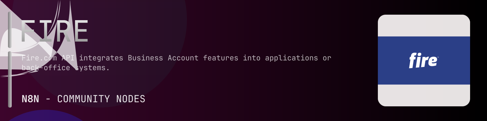

# @n8n-dev/n8n-nodes-fire



[](https://www.npmjs.com/package/@n8n-dev/n8n-nodes-fire)
[](https://opensource.org/licenses/MIT)

---

**Stop writing fire API integrations by hand.**

Every time you connect n8n to fire, you waste hours mapping endpoints, defining parameters, and debugging schemas. You copy-paste from docs, fix edge cases, and pray nothing breaks.

**What if connecting n8n to fire took 5 minutes, not half a day?**

This node gives you **10+ resources** out of the box: **Authentication**, **Accounts**, **Open Banking**, **API**, **Transactions**, and 5 more: with full CRUD operations, typed parameters, and zero manual configuration.

---

## What You Get

- **Zero boilerplate**: Resources, operations, and fields are pre-configured and ready to use
- **Full CRUD**: Create, read, update, and delete support where the API allows it
- **Typed parameters**: No more guessing field types
- **Built-in auth**: API key authentication, ready to go
- **Declarative**: Native n8n performance, no custom execute() overhead

---

## Install

```bash
npm install @n8n-dev/n8n-nodes-fire
```

**Or in n8n:**
1. **Settings → Community Nodes → Install**
2. Search: `@n8n-dev/n8n-nodes-fire`
3. Click **Install**

---

## Quick Start

1. Install the node (above)
2. Add credentials: **fire API** → paste your API key
3. Drag the **fire** node into your workflow
4. Pick a resource → pick an operation → done.

That's it. No configuration files. No code. It just works.

---

## Resources

<details>
<summary><b>Authentication</b> (1 operations)</summary>

- Post Authenticate with the API

</details>

<details>
<summary><b>Accounts</b> (3 operations)</summary>

- Get List all fire com Accounts
- Post Add a new account
- Get Retrieve the details of a fire com Account

</details>

<details>
<summary><b>Open Banking</b> (3 operations)</summary>

- Get list of ASPSPs Banks
- Post Create a Fire Open Payment request
- Get Payment Details

</details>

<details>
<summary><b>API</b> (1 operations)</summary>

- Post Create a new API Application

</details>

<details>
<summary><b>Transactions</b> (1 operations)</summary>

- Get List transactions for an account v3

</details>

<details>
<summary><b>Direct Debits</b> (8 operations)</summary>

- Get all DD payments associated with a direct debit mandate
- Get the details of a direct debit
- Post Reject a direct debit payment
- Get List all direct debit mandates
- Get direct debit mandate details
- Post Update a direct debit mandate alias
- Post Activate a direct debit mandate
- Post Cancel a direct debit mandate

</details>

<details>
<summary><b>Payment Batches</b> (12 operations)</summary>

- Get List batches
- Post Create a new batch of payments
- Delete Cancel a batch
- Get details of a single Batch
- Put Submit a batch for approval
- Get List Approvers for a Batch
- Get List items in a Batch
- Post Add a bank transfer payment to the batch
- Delete Remove a Payment from the Batch Bank Transfers
- Get List items in a Batch
- Post Add an internal transfer payment to the batch
- Delete Remove a Payment from the Batch Internal Transfer

</details>

<details>
<summary><b>Cards</b> (5 operations)</summary>

- Get View List of Cards
- Post Create a new debit card
- Post Block a card
- Get List Card Transactions
- Post Unblock a card

</details>

<details>
<summary><b>Payee Bank Accounts</b> (1 operations)</summary>

- Get List all Payee Bank Accounts

</details>

<details>
<summary><b>Users</b> (2 operations)</summary>

- Get Returns details of a specific fire com user
- Get Returns list of all users on your fire com account

</details>

---

## Why This Node?

**Without this node:**
- Hours of manual API integration
- Copy-pasting from fire docs
- Debugging auth, pagination, error handling
- Maintaining your own client code

**With this node:**
- Install → configure → use. 5 minutes.
- Auto-generated from the official fire OpenAPI spec
- Always up to date when the API changes
- Native n8n performance

---

## Auto-Generated
This node was auto-generated from the official **fire** OpenAPI specification using
[@n8n-dev/n8n-openapi-node-ultimate](https://github.com/kelvinzer0/n8n-openapi-node-ultimate),
then validated against the live API so you get accurate types and real parameters, not guesswork.

When the fire API updates, this node updates too.

---


## License

MIT © [kelvinzer0](https://github.com/n8n-code)
